# GitHub Contribution Stats

The **GitHub Contribution Stats** (`gh-contrib-stats`) is a Go-based CLI tool, which generates a [github-readme-stats](https://github.com/anuraghazra/github-readme-stats)-like SVG card showing your open-source contribution statistics.



## Quick Start

### 0. Prerequisite

- [Go](https://go.dev/) >= 1.22

### 1. Install

```bash
go install github.com/hyperfinitism/gh-contrib-stats@latest
```

Or build from source:

```bash
git clone github.com/hyperfinitism/gh-contrib-stats
cd gh-contrib-stats
go build -o gh-contrib-stats .
```

### 2. Create a GitHub Token

You need a token with read access to public repository data.

**Option A: Fine-grained personal access token (recommended)**

1. Go to [Settings > Developer settings > Personal access tokens > Fine-grained tokens](https://github.com/settings/personal-access-tokens/new)
2. Set a token name and expiration
3. Set **Repository access** to be **"Public repositories"** (Read-only access to public repositories)
4. Under **Permissions**, no additional permissions are needed for public contribution data
5. Click **Generate token** and copy it

**Option B: Use `${{ secrets.GITHUB_TOKEN }}` in GitHub Actions**

If you're running this in a GitHub Actions workflow, the built-in `GITHUB_TOKEN` secret works out of the box:

```yaml
- name: Generate contribution stats
  run: ./gh-contrib-stats --config config.yaml --output stats.svg
  env:
    GITHUB_TOKEN: ${{ secrets.GITHUB_TOKEN }}
```

### 3. Create a Config File

Create a `config.yaml`:

```yaml
username: "github-username"
# token: "ghp_..." # or set GITHUB_TOKEN env var
include-owned: false
# exclude-owners: ["owner1", "owner2"]
# exclude-repos: ["owner/repo1", "owner/repo2"]
# ...
```

Only the fields you want to override need to be specified.
See [Configuration](#configuration) for all options and defaults.

### 4. Run

```bash
# Set your token
export GITHUB_TOKEN="ghp_..."

# Generate the SVG
./gh-contrib-stats --config config.yaml --output stats.svg
```

Or pipe via stdin:

```bash
cat config.yaml | ./gh-contrib-stats --output stats.svg
```

## Configuration

| Field | Type | Default | Description |
|-------|------|---------|-------------|
| `username` | string | *required* | GitHub username |
| `token` | string | `$GITHUB_TOKEN` | GitHub personal access token |
| `include-owned` | bool | `false` | Include contributions to your own repos |
| `exclude-owners` | list | `[]` | Repository owners (users/orgs) to exclude from stats |
| `exclude-repos` | list | `[]` | Repos (`owner/repo`) to exclude from stats |
| `since` | string | 1 year before `until` | Start date (`YYYY-MM-DD`) for the contribution window |
| `until` | string | today | End date (`YYYY-MM-DD`) for the contribution window |
| `theme` | string | `"dark"` | Color theme (`dark`, `light`, `transparent`). See [Themes](#themes) |

### `select` — which contribution types to count toward the score

| Field | Default | Description |
|-------|---------|-------------|
| `pr` | `true` | Pull requests |
| `commit` | `true` | Commits |
| `issue` | `true` | Issues opened |
| `review` | `false` | PR reviews |
| `discussion` | `false` | Discussions started |

### `weight` — score multiplier per contribution type

| Field | Default |
|-------|---------|
| `pr` | `1` |
| `commit` | `1` |
| `issue` | `1` |
| `review` | `1` |
| `discussion` | `1` |

### `show` — what to display in the SVG card

| Field | Default | Description |
|-------|---------|-------------|
| `pr` | `true` | Show PR count |
| `commit` | `true` | Show commit count |
| `issue` | `true` | Show issue count |
| `review` | `false` | Show review count |
| `discussion` | `false` | Show discussion count |
| `top-repo` | `3` | Number of top contributed repos to list |

## Themes

Built-in themes are defined in [`configs/theme.yaml`](configs/theme.yaml):

| Theme | Description |
|-------|-------------|
| `dark` | GitHub dark theme (default) |
| `light` | GitHub light theme |
| `transparent` | Dark text/icons with transparent background |

To use a theme, set the `theme` field in your config:

```yaml
theme: "light"
```

To define a custom theme, edit [`internal/config/themes.yaml`](internal/config/themes.yaml) and rebuild. Each theme defines `background`, `border`, `title`, `text`, `muted`, `star` colors and per-icon colors under `icons`.

## Limitations

- **Date range:** The GitHub API provides contribution data in at-most-one-year windows. When `since`/`until` span multiple years, gh-contrib-stats automatically queries each year and aggregates the results. If neither field is set, the default window is the past year.
- **Repository cap:** Each yearly window returns at most 100 repositories per contribution type. For users contributing to more than 100 repositories in a single year, some repositories may be omitted from the per-repo breakdown and top-repos list. The total counts for each contribution type are still accurate when no exclusion filters are applied.

## Licenses

- The source code is licensed under [Apache-2.0](LICENSE-Apache-2.0) OR [MIT](LICENSE-MIT).
- The [Primer Octicons](https://github.com/primer/octicons) icon assets in `third_party/primer-octicons/` are redistributed under [MIT](third_party/primer-octicons/LICENSE.txt).
  See [NOTICE.md](NOTICE.md) for details.
